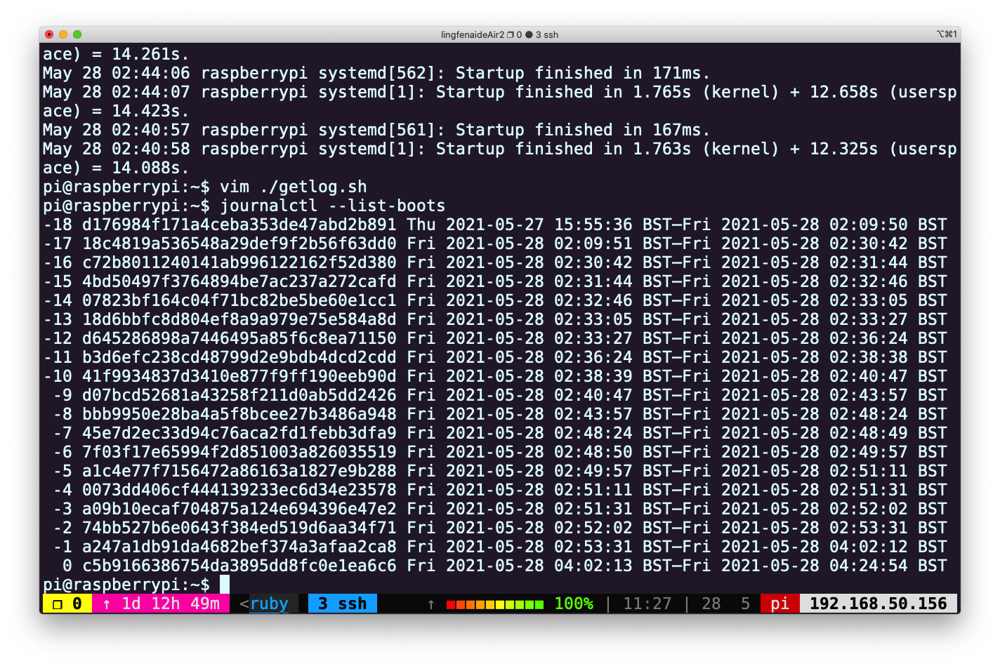

# Solution-数据清洗

1. 学习一下这篇简短的 [交互式正则表达式教程](https://regexone.com/).
2. 统计 words 文件 (`/usr/share/dict/words`) 中包含至少三个 `a` 且不以 `'s` 结尾的单词个数。

   ```bash
   #这里我是在树莓派上面操作的
   cat /usr/share/dict/words | tr "[:upper:]" "[:lower:]" | grep -E "^([^a]*a){3}.*$" | grep -v "'s$" | wc -l
   # 850
   ```

   
   - 大小写转换：`tr "[:upper:]" "[:lower:]"`  
   - `^([^a]*a){3}.*[^'s]$`：查找一个以 a 结尾的字符串三次
   - `grep -v "\'s$"`：匹配结尾为's 的结果，然后取反。借助 `grep -v` 主要是这里不支持 lookback，不然下面的正则就可以完成

   ```bash
   ^([^a]*a){3}.*(?<!'s)$
   ```

   这些单词中，出现频率前三的末尾两个字母是什么？ `sed` 的 `y` 命令，或者 `tr` 程序也许可以帮你解决大小写的问题。

   ```bash
   cat /usr/share/dict/words | tr "[:upper:]" "[:lower:]" | grep -E "^([^a]*a){3}.*$" | grep -v "'s$" | sed -E "s/.*([a-z]{2})$/\1/" | sort | uniq -c | sort | tail -n3
   # 53 as
   # 64 ns
   # 102 an
   ```

   共存在多少种词尾两字母组合？

   ```bash
   cat /usr/share/dict/words | tr "[:upper:]" "[:lower:]" | grep -E "^([^a]*a){3}.*$" | grep -v "'s$" | sed -E "s/.*([a-z]{2})$/\1/" | sort | uniq | wc -l
   ```

   还有一个很 有挑战性的问题：哪个组合从未出现过？为了得到没出现的组合，首先我们要生成一个包含全部组合的列表，然后再使用上面得到的出现的组合，比较二者不同即可。

   ```bash
   #!/bin/bash
   for i in {a..z};do
      for j in {a..z};do
         echo  "$i$j"
      done
   done
   ```

   ```bash
   ./all.sh > all.txt
   ```

   ```bash
   cat /usr/share/dict/words | tr "[:upper:]" "[:lower:]" | grep -E "^([^a]*a){3}.*$" | grep -v "'s$" | sed -E "s/.*([a-z]{2})$/\1/" | sort | uniq > occurance.txt
   ```

   ```bash
   diff --unchanged-group-format='' <(cat occurance.txt) <(cat all.txt) | wc -l
   ```

   `--unchanged-group-format=''` 用于将两个文件中相同的内容设置为空字符串，剩下的内容就是差异的部分。
3. 进行原地替换听上去很有诱惑力，例如：`sed s/REGEX/SUBSTITUTION/ input.txt > input.txt`。但是这并不是一个明智的做法，为什么呢？还是说只有 `sed` 是这样的? 查看 `man sed` 来完成这个问题。  `sed s/REGEX/SUBSTITUTION/ input.txt > input.txt` 表达式中后一个 `input.txt` 会首先被清空，而且是发生在前的。所以前面一个 `input.txt` 在还没有被 `sed` 处理时已经为空了。在使用正则处理文件前最好是首先备份文件。

   ```bash
   sed -i.bak s/REGEX/SUBSTITUTION/ input.txt
   ```

   可以自动创建一个后缀为 `.bak` 的备份文件。
4. 找出您最近十次开机的开机时间平均数、中位数和最长时间。在 Linux 上需要用到 `journalctl` ，而在 macOS 上使用 `log show`。找到每次起到开始和结束时的时间戳。在 Linux 上类似这样操作：

   ```plaintext
   Logs begin at ...
   ```

   和

   ```plaintext
   systemd[577]: Startup finished in ...
   ```

   在 macOS 上, [查找](https://eclecticlight.co/2018/03/21/macos-unified-log-3-finding-your-way/):

   ```plaintext
   === system boot:
   ```

   和

   ```plaintext
   Previous shutdown cause: 5
   ```

   为了进行这个练习，我们需要首先允许 `journalctl` 记录多次开机的日志，具体背景信息可以参考 [这里](https://www.digitalocean.com/community/tutorials/how-to-use-journalctl-to-view-and-manipulate-systemd-logs) 和 [这里](https://askubuntu.com/questions/765315/how-to-find-previous-boot-log-after-ubuntu-16-04-restarts) 否则我们看到的始终都只有本次启动的日志。

   ```bash
   vim /etc/systemd/journald.conf
   ```

   设置 `Storage=persistent` 执行上述命令后，重启

   ```bash
   pi@raspberrypi:~$ journalctl --list-boots
   -1 d176984f171a4ceba353de47abd2b891 Thu 2021-05-27 15:55:36 BST—Fri 2021-05-28 02:09:50 BST
   0 18c4819a536548a29def9f2b56f63dd0 Fri 2021-05-28 02:09:51 BST—Fri 2021-05-28 02:25:50 BST
   ```

   可以看到已经可以列出多次启动信息了，然后我们进行十次重启。
   
   可以使用 `systemd-analyze` 工具看一下启动时间都花在哪里：

   ```bash
   sudo systemd-analyze plot > systemd.svg
   ```

   
   可以看到启动时间为 14.157s。接下来，编写脚本 `getlog.sh` 来获取最近十次的启动时间数据：

   ```bash
   #!/bin/bash
   for i in {0..9}; do
      journalctl -b-$i | grep "Startup finished in"
   done
   ```

   ```bash
   ./getlog > starttime.txt
   ```

   ```bash
   #获取最长时间
   cat starttime.txt | grep "systemd\[1\]" | sed -E "s/.*=\ (.*)s\.$/\1/"| sort | tail -n1
   #获取最短时间
   cat starttime.txt | grep "systemd\[1\]" | sed -E "s/.*=\ (.*)s\.$/\1/"| sort -r | tail -n1
   #平均数（注意 awk 要使用单引号）
   cat starttime.txt | grep "systemd\[1\]" | sed -E "s/.*=\ (.*)s\.$/\1/"| paste -sd+ | bc -l | awk '{print $1/10}'
   # 中位数
   cat starttime.txt | grep "systemd\[1\]" | sed -E "s/.*=\ (.*)s\.$/\1/"| sort |paste -sd\  | awk '{print ($5+$6)/2}'
   ```

   如果配合使用 R 语言脚本则更加简单：

   ```bash
   sudo apt-get install r-base
   ```

   ```bash
   cat starttime.txt | grep "systemd\[1\]" | sed -E "s/.*=\ (.*)s\.$/\1/"| sort | R -e 'd<-scan("stdin",quiet=TRUE);min(d);max(d);mean(d);median(d);'
   ```

   ```bash
   > d<-scan("stdin",quiet=TRUE);min(d);max(d);mean(d);median(d);
   [1] 14.023
   [1] 15.989
   [1] 14.4304
   [1] 14.2915
   ```

5. 查看之前三次重启启动信息中不同的部分(参见 `journalctl` 的 `-b` 选项)。将这一任务分为几个步骤，首先获取之前三次启动的启动日志，也许获取启动日志的命令就有合适的选项可以帮助您提取前三次启动的日志，亦或者您可以使用 `sed '0,/STRING/d'` 来删除 `STRING` 匹配到的字符串前面的全部内容。然后，过滤掉每次都不相同的部分，例如时间戳。下一步，重复记录输入行并对其计数(可以使用 `uniq` )。最后，删除所有出现过 3 次的内容（因为这些内容上三次启动日志中的重复部分）。简单修改上面使用的 `getlog.sh`，获取最近三次的日志，然后使用下面的命令：

   ```bash
   #注意 uniq 只能过滤相邻的行，所以必须先排序
   cat last3start.txt | sed -E "s/.*pi\ (.*)/\1/" | sort | uniq -c | sort | awk '$1!=3  { print }'
   ```

6. 在网上找一个类似 [这个](https://stats.wikimedia.org/EN/TablesWikipediaZZ.htm) 或者 [这个](https://ucr.fbi.gov/crime-in-the-u.s/2016/crime-in-the-u.s.-2016/topic-pages/tables/table-1) 的数据集。或者从 [这里](https://www.springboard.com/blog/free-public-data-sets-data-science-project/) 找一些。使用 `curl` 获取数据集并提取其中两列数据，如果您想要获取的是 HTML 数据，那么 [pup](https://github.com/EricChiang/pup) 可能会更有帮助。对于 JSON 类型的数据，可以试试 [jq](https://stedolan.github.io/jq/) 。请使用一条指令来找出其中一列的最大值和最小值，用另外一条指令计算两列之间差的总和。

   ```shell
   ~$ curl 'https://stats.wikimedia.org/EN/TablesWikipediaZZ.htm#wikipedians' \
       |sed -n "/table1/,/<\/table>/p" \
       |grep "<tr" | sed "1,12d"|head -n -3 \
       |sed -E 's/(<[^>]*>)+/ /g' \
       |sed 's/ &nbsp;/ -/g' \
       |sed 's/&nbsp;//g' > data
   
   ~$ cat data # 处理后的数据为 Jan2001 截至 Oct2018 的
   Oct2018 2642056 12641 70805 10498 48.9M - 6101 - - - - 10.3M - - - - - - 42.6M 
   Sep2018 2629415 11171 66574 10004 48.7M - 6116 - - - - 10.1M - - - - - - 42.4M 
   Aug2018 2618244 12058 68688 10640 48.5M - 6839 - - - - 10.2M - - - - - - 42.1M 
   Jul2018 2606186 12026 68037 10305 48.3M - 6987 - - - - 9.5M - - - - - - 41.9M 
   ...
   Jan2001 7 7 9 - 31 12 1 8.6 1352 29% 10% 267 301kB 3.0k 15 - - 2 163 
   ```

   命令说明（建议先查看网站的源码格式，更加容易理解下面的操作）

   - `|sed -n "/table1/,/<\/table>/p"`：观察网站的源代码，可以发现第一个表格的 id 为 `table1`，该命令将截取匹配到的 `table1` 以及下一个 `</table>` 标签行之间的内容
   - `|grep "<tr"`：html 表格中，含有数据的行是以 `<tr` 开头，匹配这样的行
   - `|sed "1,12d"`：去掉前 12 行（包含表格的表头）
   - `|head -n -3`：去掉最后 3 行（包含非数据的内容）（注意：部分操作系统可能不支持该用法，最笨拙的替换实现方式是：`|sed "$d"|sed "$d"|sed "$d"`，即执行 3 次删除最后一行的操作）
   - `|sed -E 's/(<[^>]*>)+/ /g'`：使用正则匹配，将所有相邻的多个 html 标签（格式行如 `< tag >` ）替换为空格
   - `|sed 's/ &nbsp;/ -/g'`：原表格中部分没有数据的单元格是以 `&nbsp;` 填充的，将其替换为 `-`，避免在对数据操作时发生窜列的情况
   - `|sed 's/&nbsp;//g'`：原表格中部分单元格内的空格也是用 `&nbsp;` 表示的，将其全部删除（不影响数据处理）

   ```shell
   ~$ awk '{print $1,$4,$5}' data | sort --key=2n | head -n 1
   Jan2001 9 -
   # 从data中读取第一列（时间，用来定位后续结果）及第三、四列，并以第二行的数据以数字大小进行排序，然后显示最大值的结果；下一个命令显示最小值的结果

   ~$ awk '{print $1,$4,$5}' data | sort --key=2n | tail -n 1
   Mar2007 91388 11506

   ~$ awk '{print $1,$4,$5}' data | awk '{print $2-$3}' | awk '{s+=$1} END {print s}'
   10153001
   # 使用第二列的数据减去第三列的数据后，将结果加总
   ```
